<h3>Compte Rendu Tp1</h3>

On considère le schéma suivant 

1. Créaction de l'interface IDao avec une méthode getDate et ses Implemantation

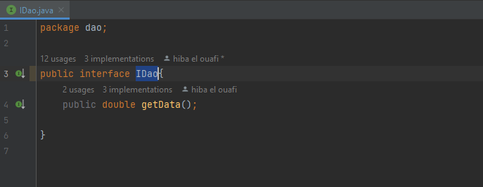

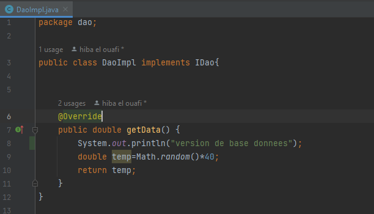

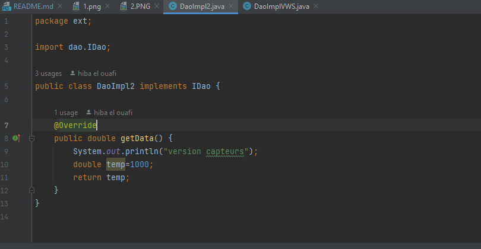

2. Créer l'interface IMetier avec une méthode calcul et son implémentation en utilisant le couplage faible

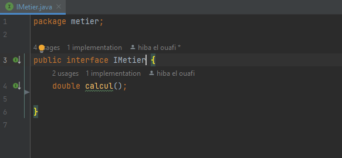

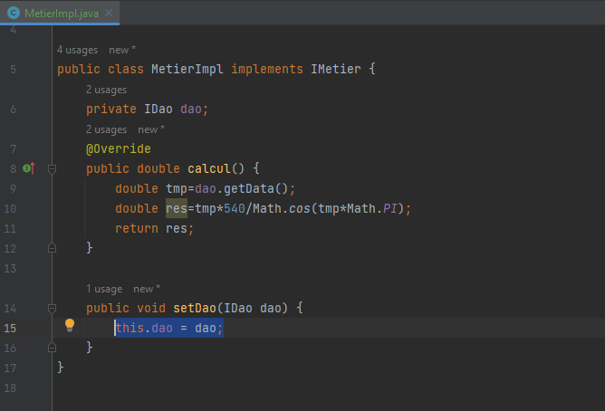

3. Faire l'injection des dépendances Par instanciation statique

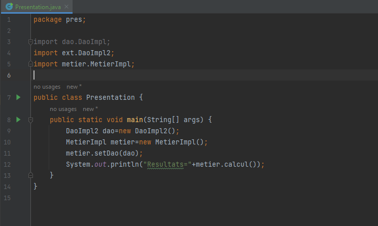

Resultat d'execution:

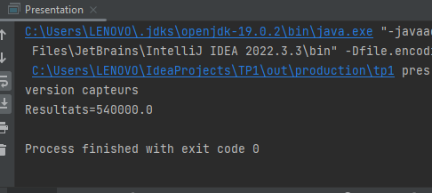

3. Faire l'injection des dépendances Par instanciation dynamique

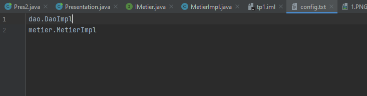

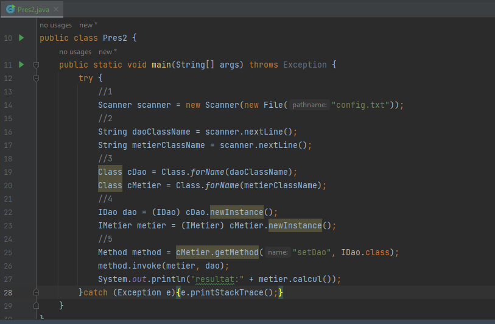

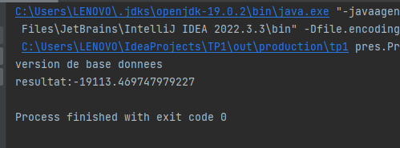
 

4. Faire l'injection des dépendances avec Spring  
   a. Version XML:

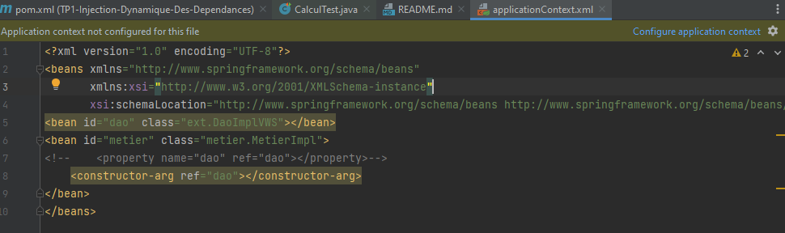
 

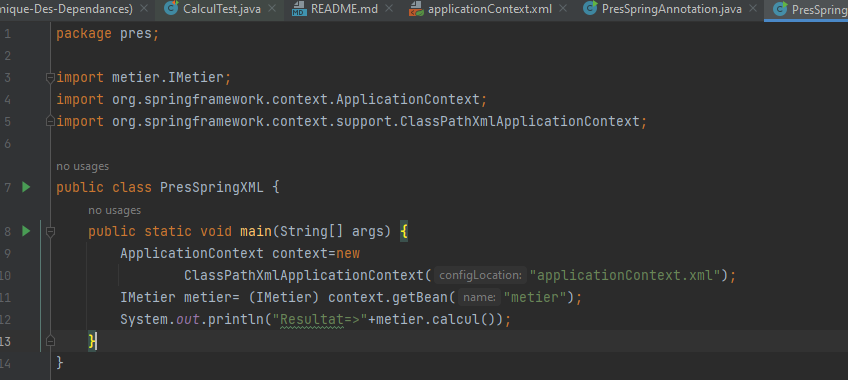
 
Resultat d'execution:

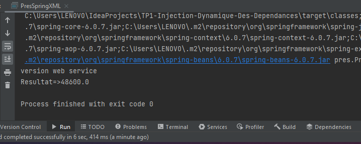
 

   b. Version Annotation:

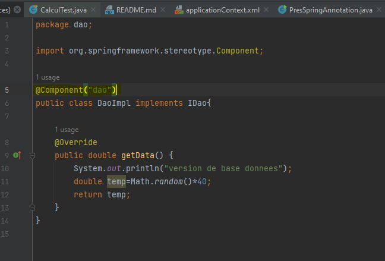
 

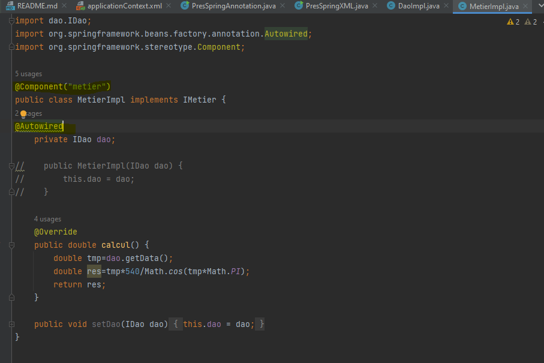
 

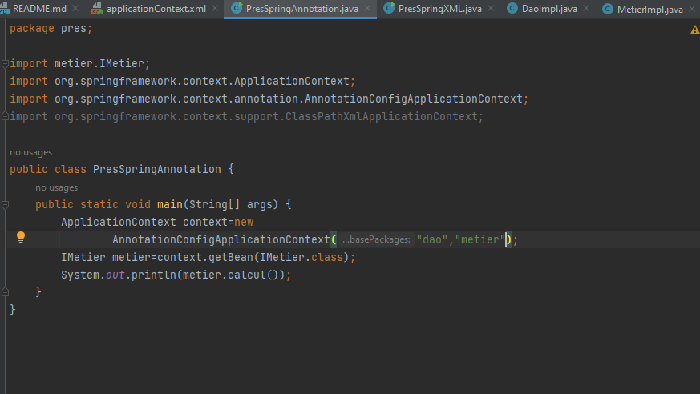
 
Resultat d'execution:

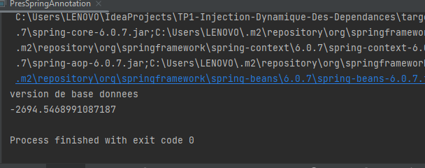
 

